# Click Count application

[](https://travis-ci.org/xebia-france/click-count)

---

Sommaire
=================

<!--ts-->

- [Introduction, Description du travail effectué](#introduction-description-du-travail-effectué)
- [Récupération des sources et configuration des futures infra](#récupération-des-sources-et-configuration-des-futures-infra)
- [Lancement du projet Java en local](#lancement-du-projet-java-en-local)
  * [Pré-requis éxécution locale](#pré-requis-éxécution-locale)
- [Solution basée sur une infra EC2](#solution-basée-sur-une-infra-ec2)
  * [Pré-requis déploiement EC2](#pré-requis-déploiement-ec2)
  * [Présentation infra et pipeline EC2](#présentation-infra-et-pipeline-ec2)
  * [Création de l'infra EC2, éxécution de la pipeline, suppression des ressources](#création-de-linfra-ec2-éxécution-de-la-pipeline-suppression-des-ressources)
- [Solution basée sur une infra Kubernetes](#solution-basée-sur-une-infra-kubernetes)
  * [Pré-requis déploiement Kube](#pré-requis-déploiement-kubernetes)
  * [Présentation infra et pipeline Kube](#présentation-infra-et-pipeline-kube)
  * [Création de l'infra Kube, éxécution de la pipeline, suppression des ressources](#création-de-linfra-ec2-éxécution-de-la-pipeline-suppression-des-ressources)
- [Une appartée sur les tests](#une-appartée-sur-les-tests)
- [Reste à faire](#reste-à-faire)
- [Notes](#notes)

---

# Introduction, Description du travail effectué

Le but de ce projet est d'implémenter une pipeline et des environnements de staging et de production pour une application Java existante.

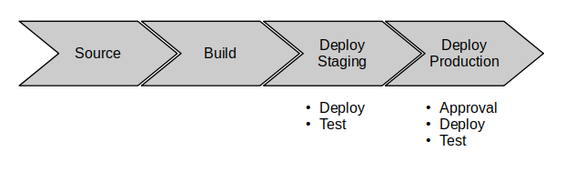

Ce projet est composé de:
- Code source Java migré de `Tomcat` à `SpringBoot`, avec des tests d'intégration en local basés sur [testcontainers](https://www.testcontainers.org/).
- Code d'infra et de pipeline pour des déploiements basés sur EC2
- Code d'infra et de pipeline pour des déploiements basés sur Kubernetes (AWS EKS)

# Récupération des sources et configuration des futures infra

1. Forker le repo
2. Dans `infra/infra.env`, modifier:
  - 2.1 le nom du repo github avec votre identifiant
  - 2.2 le chemin vers une clé ssh publique que vous souhaitez utiliser pour accéder aux machines de rebond des différents environnements

  Ensuite, référez-vous aux pré-requis de chaque section: "éxécution locale", "déploiement EC2", "déploiement Kubernetes" 

# Lancement du projet Java en local

## Pré-requis éxécution locale

- maven: [https://maven.apache.org/download.cgi](https://maven.apache.org/download.cgi)
- Docker pour lancer les tests d'intégration en local: [https://docs.docker.com/engine/install/](https://docs.docker.com/engine/install/)
- Docker-Compose pour lancer les tests d'intégration en local: [https://docs.docker.com/compose/](https://docs.docker.com/compose/)

## Lancement du projet et tests

- build de l'application
  - `mvn clean verify` pour builder le jar de l'application et lancer les tests d'intégration dockerisés
  - `mvn clean verify -P docker` pour builder l'image `Docker` de l'application et lancer les tests d'intégration dockerisés
  
Voici un exemple de logs d'éxécution avec `Maven`:

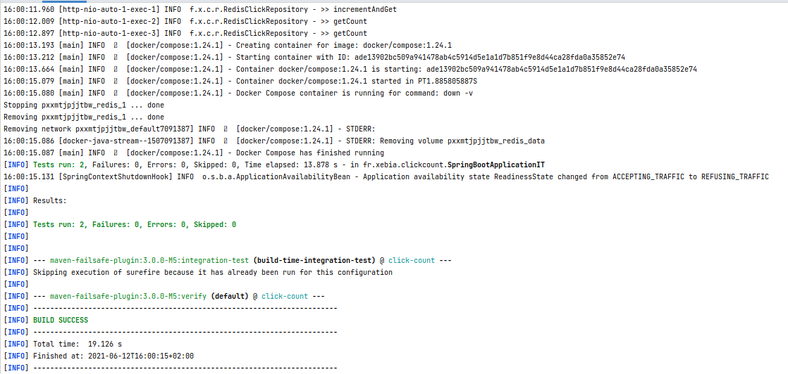

- éxécution en local:
  - Lancer une instance locale de `Redis`: `docker-compose down && docker-compose up`
  - Lancer l'application: `mvn spring-boot:run` ou via l'IDE
  - éxécuter des requêtes sur l'API REST: 

```shell
08:34:03 joseph@joseph-ThinkPad-T480 infra ±|main ✗|→ curl localhost:8080/healthcheck -w"\n"
ok
08:34:06 joseph@joseph-ThinkPad-T480 infra ±|main ✗|→ curl localhost:8080/click -w"\n"
8
08:35:20 joseph@joseph-ThinkPad-T480 infra ±|main ✗|→ curl -X POST localhost:8080/click -w"\n"
9

```

# Solution basée sur une infra EC2

## Pré-requis déploiement EC2

- aws cli: [https://docs.aws.amazon.com/cli/latest/userguide/install-cliv2.html](https://docs.aws.amazon.com/cli/latest/userguide/install-cliv2.html)
- make: [https://www.gnu.org/software/make/](https://www.gnu.org/software/make/)
- packer pour les déploiements basés sur EC2: [https://www.packer.io/downloads](https://www.packer.io/downloads)

## Présentation infra et pipeline EC2

La pipeline implémentée est la suivante: 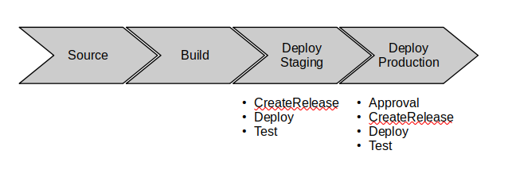

L'étape "CreateRelease" des stages "DeployStaging" et "DeployProduction" construit le fichier de properties de l'application java, contenant l'addresse et le port de `Redis` pour l'environnement en question.

---

Ensuite, voici un schema de l'infrastructure d'un environnement (staging ou production) basé sur EC2:

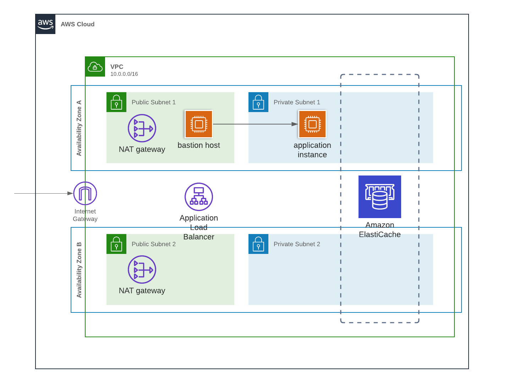

Chaque environnement est dans son propre VPC et utilise un même template `CloudFormation` paramétrable en fonction des spécificités de l'environnement.

Notre application tourne dans une instance EC2, dans un sous-réseau privé, et est accessible depuis l'extérieur via un "internet-facing" load balancer

Le code de cette infra se trouve dans `infra/ec2-environment`, est composé de plusieurs "modules", assemblés dans `infra/ec2-environment/ec2-environment.yml`

Tout est créé via `CloudFormation`, à l'exception de l'AMI de nos instances de staging et production, qui utilise `Packer`.
La création du tout: ami, environnement (réseau, cluster redis, instance EC2), pipeline est orchestré par `Makefile`

## Création de l'infra EC2, éxécution de la pipeline, suppression des ressources

L'infra est créée par un `Makefile`.
0. forkez le repo et modifier la variable `GITHUB_REPO` dans `infra/infra.env` (cf [pré-requis](#pré-requis))
1. déplacez-vous dans le répertoire `infra`: `cd infra`
2. lancez la création des environnements `staging`, `production` et la pipeline de déploiement: `make ec2-all APPLICATION_NAME=click-count`. Vérifiez la création des stacks `CloudFormation`. Comptez 20-30 minutes

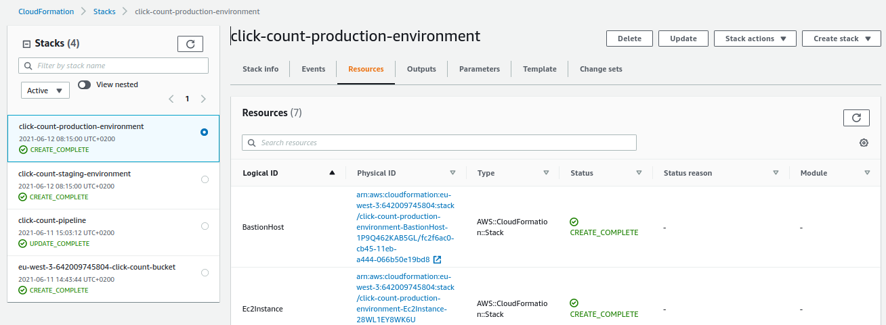

3. Activez la connexion github dans `Developer Tools`. cf documentation [https://docs.aws.amazon.com/dtconsole/latest/userguide/connections-update.html](https://docs.aws.amazon.com/dtconsole/latest/userguide/connections-update.html)

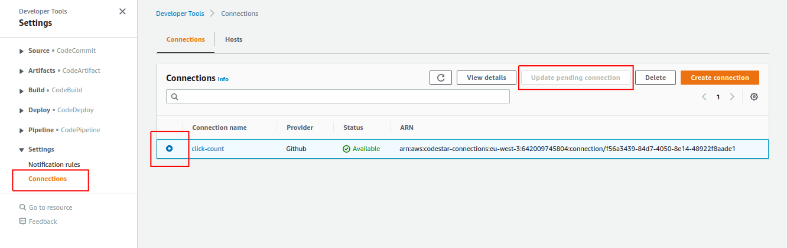

4. Relancez la pipeline si elle a échoué (à cause de la connection gitub non-activée). Elle devrait s'éxécuter sans problème jusqu'en staging

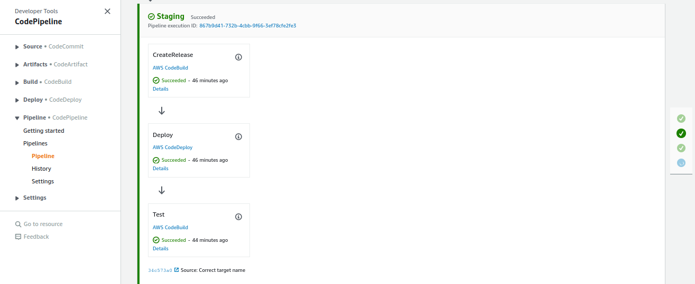

5. La pipeline éxécute des tests sur l'application déployée en staging, mais assurons-nous en par un test manuel. 
  - Récupérez l'addresse publique du load balancer:

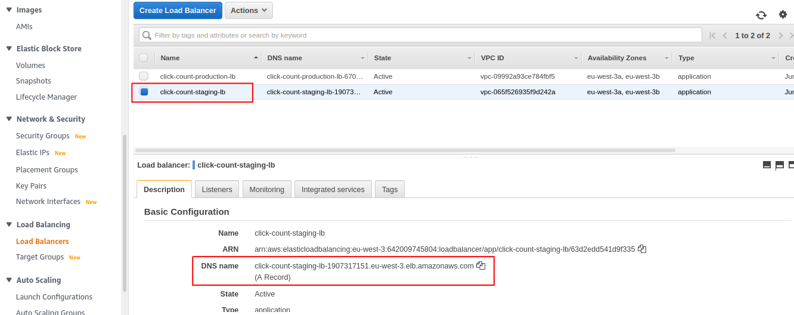

  - éxécutons des requêtes curl sur les différents endpoints:

```shell
09:20:57 joseph@joseph-ThinkPad-T480 ~ → curl click-count-staging-lb-1907317151.eu-west-3.elb.amazonaws.com/healthcheck -w "\n"
ok
09:21:07 joseph@joseph-ThinkPad-T480 ~ → curl click-count-staging-lb-1907317151.eu-west-3.elb.amazonaws.com/click -w "\n"
1
09:21:14 joseph@joseph-ThinkPad-T480 ~ → curl -X POST click-count-staging-lb-1907317151.eu-west-3.elb.amazonaws.com/click -w "\n"
2
```

6. Approuvons le déploiement en production

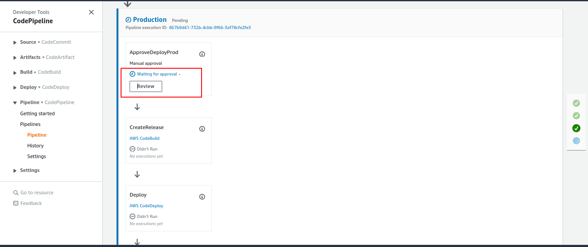

Cliquons ensuite sur "Approve":

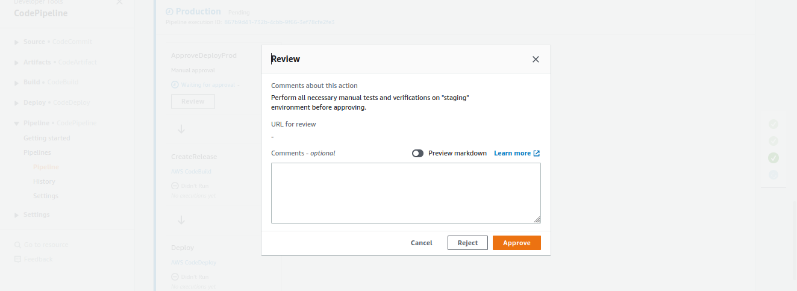

La pipeline devrait être verte en prod aussi:

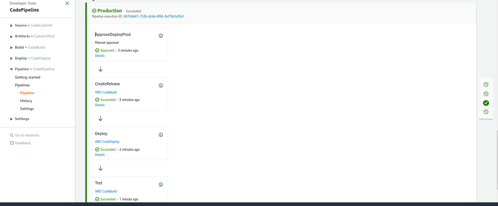

Ici aussi, on peut se convaincre que tout a bien marché par un test manuel:

On récupère l'url du Load Balancer de prod:

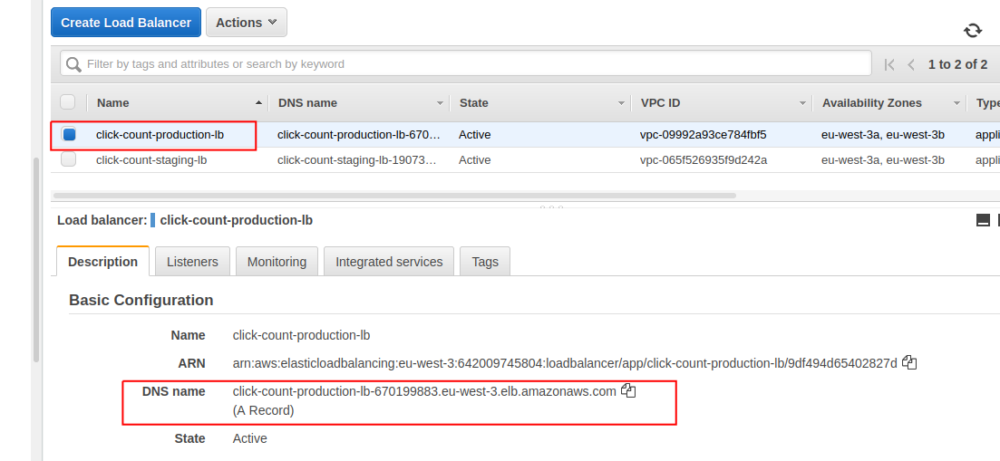

On effectue nos requêtes `curl` de test:

```shell
09:31:32 joseph@joseph-ThinkPad-T480 ~ → curl click-count-production-lb-670199883.eu-west-3.elb.amazonaws.com/healthcheck -w "\n"
ok
09:32:19 joseph@joseph-ThinkPad-T480 ~ → curl click-count-production-lb-670199883.eu-west-3.elb.amazonaws.com/click -w "\n"
1
09:32:26 joseph@joseph-ThinkPad-T480 ~ → curl -X POST click-count-production-lb-670199883.eu-west-3.elb.amazonaws.com/click -w "\n"
2
```

7. Nous pouvons désormais supprimer toutes les ressources créées:
`make delete-ec2-all APPLICATION_NAME=click-count`

Le processus est un peu long, 15-20 minutes, mais toutes les ressources devraient être supprimées avec succès :

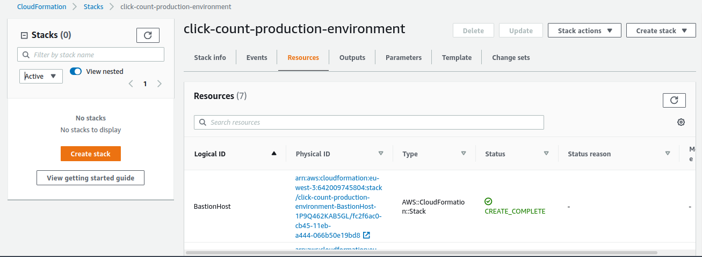

Et l'AMI créée devrait elle aussi être supprimée:

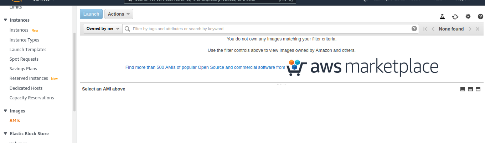

# Solution basée sur une infra Kubernetes

## Pré-requis déploiement Kubernetes

- aws cli: [https://docs.aws.amazon.com/cli/latest/userguide/install-cliv2.html](https://docs.aws.amazon.com/cli/latest/userguide/install-cliv2.html)
- make: [https://www.gnu.org/software/make/](https://www.gnu.org/software/make/)
- eksctl: [https://eksctl.io/](https://eksctl.io/)

## Présentation infra et pipeline Kube

La pipeline implémentée est la suivante: 

Il n'y a pas d'étape `CreateRelease`, les properties sont injectées dans l'application par variable d'environnement, chose qui ne semble pas possible de faire, pas aisément du moins, pour le déploiement EC2 avec `CodeDeploy`.

---

Sinon voici l'infrastructure `Kubernetes` qui sera créée:

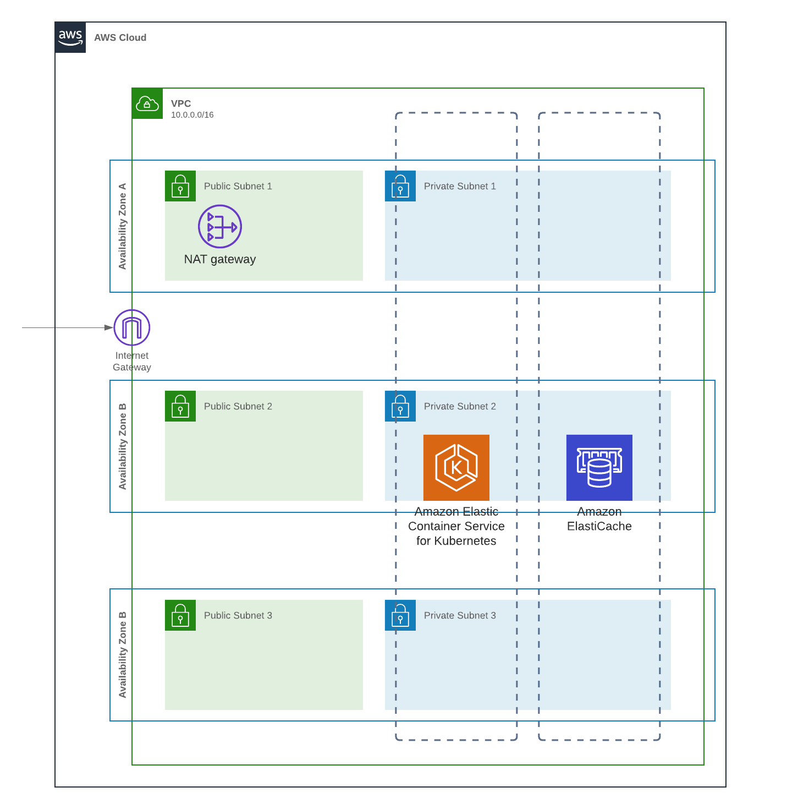

Nous n'avons pas trouvé de moyen de créer facilement et dans le temps imparti le cluster Kubernetes via `CloudFormation` uniquement. 
Nous avons donc fini par nous résoudre à créer le cluster et le réseau via l'outil `eksctl`, qui est conseillé par la documentation d'AWS pour démarrer. 

---

Nous allons maintenant nos ressources d'infra et éxécuter la pipeline jusqu'au bout.


## Création de l'infra Kube, éxécution de la pipeline, suppression des ressources

L'infra est créée par un `Makefile`.
0. forkez le repo et modifier la variable `GITHUB_REPO` dans `infra/infra.env` (cf [pré-requis](#pré-requis))
1. déplacez-vous dans le répertoire `infra`: `cd infra`
2. Si vous avez créé juste avant le déploiement EC2 et ne l'avez pas encore supprimé, utilisez un autre compte AWS ou une autre région. Ce projet utilise la variable d'environnement `AWS_REGION`.
   
```shell
# optionnel
export AWS_REGION=eu-west-1
```

3. lancez la création des environnements `staging`, `production` et la pipeline de déploiement: `make kube-all APPLICATION_NAME=click-count`. Vérifiez la création des stacks `CloudFormation`. Comptez 20-30 minutes
4. Vérifiez la bonne éxécution des templates `CloudFormation`:

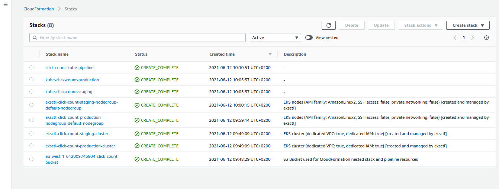

5. Activez la connexion github dans `Developer Tools`. cf documentation [https://docs.aws.amazon.com/dtconsole/latest/userguide/connections-update.html](https://docs.aws.amazon.com/dtconsole/latest/userguide/connections-update.html)


6. Relancez la pipeline, celle-ci devrait être verte jusqu'en `staging` 
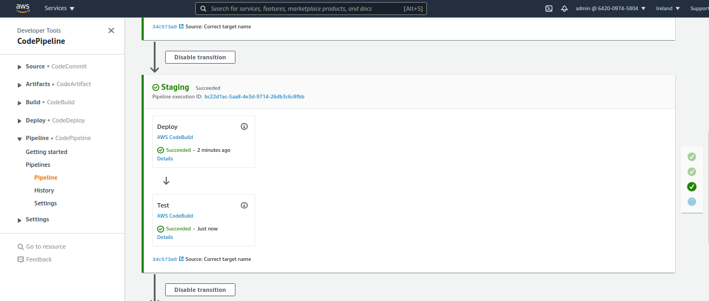
   
Ici aussi, comme pour les déploiement EC2, bien que l'application soit testée après son déploiement, nous allons vérifier à la main pour nous en convaincre:

```shell
03:23:25 joseph@joseph-ThinkPad-T480 ~ → eksctl get cluster --region eu-west-1
2021-06-12 15:23:36 [ℹ]  eksctl version 0.43.0
2021-06-12 15:23:36 [ℹ]  using region eu-west-1
NAME			REGION		EKSCTL CREATED
click-count-production	eu-west-1	True
click-count-staging	eu-west-1	True
03:23:37 joseph@joseph-ThinkPad-T480 ~ → aws eks update-kubeconfig --name click-count-staging --region eu-west-1
Updated context arn:aws:eks:eu-west-1:642009745804:cluster/click-count-staging in /home/joseph/.kube/config
03:23:40 joseph@joseph-ThinkPad-T480 ~ → k get svc
NAME          TYPE           CLUSTER-IP       EXTERNAL-IP                                                              PORT(S)        AGE
click-count   LoadBalancer   10.100.185.169   a6881225eb5bf4480bf523f4e3aaebc0-739792065.eu-west-1.elb.amazonaws.com   80:31942/TCP   19m
kubernetes    ClusterIP      10.100.0.1       <none>                                                                   443/TCP        5h26m
03:23:46 joseph@joseph-ThinkPad-T480 ~ → curl a6881225eb5bf4480bf523f4e3aaebc0-739792065.eu-west-1.elb.amazonaws.com/healthcheck -w "\n"
ok
03:23:58 joseph@joseph-ThinkPad-T480 ~ → curl a6881225eb5bf4480bf523f4e3aaebc0-739792065.eu-west-1.elb.amazonaws.com/click -w "\n"
2
03:24:03 joseph@joseph-ThinkPad-T480 ~ → curl -X POST a6881225eb5bf4480bf523f4e3aaebc0-739792065.eu-west-1.elb.amazonaws.com/click -w "\n"
3
```

7. Approuvez le déploiement en prod: 

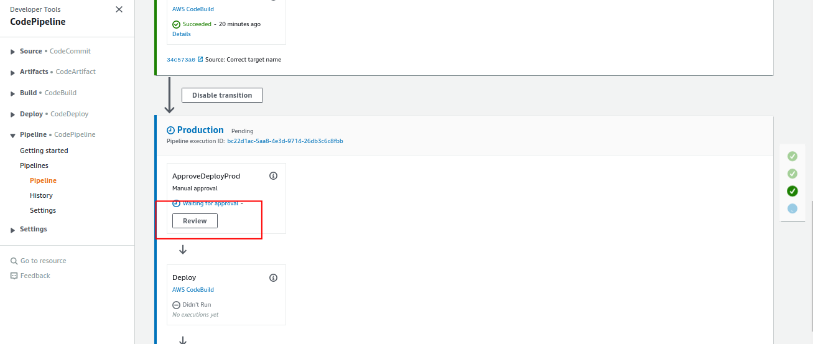

cliquez sur "Approve":

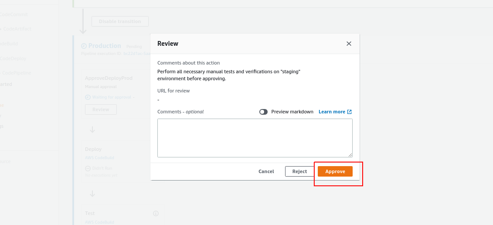

La pipeline devrait être verte en production:

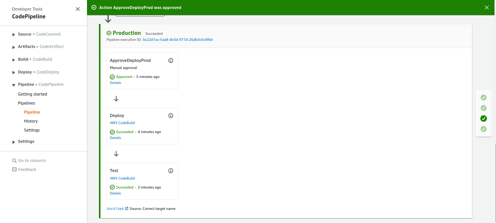

Ici aussi, vérifions manuellement pour se convaincre que tout a bien marché:

```shell
03:24:10 joseph@joseph-ThinkPad-T480 ~ → aws eks update-kubeconfig --name click-count-production --region eu-west-1
Updated context arn:aws:eks:eu-west-1:642009745804:cluster/click-count-production in /home/joseph/.kube/config
03:36:19 joseph@joseph-ThinkPad-T480 ~ → k get svc
NAME          TYPE           CLUSTER-IP      EXTERNAL-IP                                                               PORT(S)        AGE
click-count   LoadBalancer   10.100.35.113   ac646eca5652a427c80250cec4e48696-1890102600.eu-west-1.elb.amazonaws.com   80:30334/TCP   6m11s
kubernetes    ClusterIP      10.100.0.1      <none>                                                                    443/TCP        5h39m
03:36:35 joseph@joseph-ThinkPad-T480 ~ → curl ac646eca5652a427c80250cec4e48696-1890102600.eu-west-1.elb.amazonaws.com/healthcheck -w "\n"
ok
03:36:46 joseph@joseph-ThinkPad-T480 ~ → curl ac646eca5652a427c80250cec4e48696-1890102600.eu-west-1.elb.amazonaws.com/click -w "\n"
1
03:36:57 joseph@joseph-ThinkPad-T480 ~ → curl -X POST ac646eca5652a427c80250cec4e48696-1890102600.eu-west-1.elb.amazonaws.com/click -w "\n"
2
```

Parfait !

8. Supprimez toutes les ressources créées pour ce déploiement, cela devrait prendre environ 15 minutes : 

```shell
make kube-delete-all APPLICATION_NAME=click-count
```

# Une appartée sur les tests

Voici les tests que nous avons rajouté au projet et aux pipelines :

1. Des tests d'intégration locaux, basés sur [testcontainers](https://www.testcontainers.org/). Ils lancent un `Redis` dans un conteneur et l'application s'y connecte pour le test.
  - `./src/test/java/fr/xebia/clickcount/SpringBootApplicationIT.java` pour la classe de test
  - À lancer via: `mvn verify`
  - en cas d'erreur `ERROR o.t.utility.ResourceReaper - Timed out waiting for Ryuk container to start. Ryuk's logs:`, relancez le service Docker: `sudo systemctl restart docker.services`
2. Des tests que l'on va qualifier "d'API", qui sont éxécutés sur l'application après son déploiement sur un environnement.
  - 2.1 `./src/test/resources/features/api-test.feature` pour le test Cucumber 
    - `./src/test/java/fr/xebia/clickcount/ApiTestCucumberRunner.java` pour le runner
    - `./src/test/java/fr/xebia/clickcount/ApiTestCucumberStepDefinitions.java` pour l'implémentation des steps
  - 2.3 `./infra/ec2-environment/pipeline/integration-test-runner/integration-test-runner.yml` pour le template CFN du projet `CodeBuild` dédié aux tests sur le déploiement EC2
  - 2.4 `./infra/kubernetes/pipeline/integration-test-runner/kube-integration-test-runner.yml` pour le template CFN du projet `CodeBuild` dédié aux tests sur le déploiement Kube

Ces tests génèrent un rapport d'éxécution, accessible dans "Reports" de l'éxécution `CodeBuild`, ou encore dans "Report Groups".

Malheureusement, j'ai supprimé les infras et pipeline au moment de la rédaction de ces lignes, du coup pas de screenshot. Mais vous devriez pouvoir trouver 

# Reste à faire 

1. Mieux définir et expliciter les propriétés des templates `CloudFormation` pour les environnements de staging et de prod. À part la configuration réseau pour le déploiement EC2, les environnements sont des clones avec les mêmes paramètres
2. Lancer les tests d'API pour le déploiement EC2 au niveau du Load Balancer. Ils ne sont éxécutés qu'au niveau de l'instance
3. Ajouter de la configuration SSL/TLS et plus se pencher sur la sécurité.
4. Rollback automatique en cas d'erreur. Typiquement via une alerte `CloudWatch` si l'application log une erreur, renvoie une HTTP5XX, etc.
5. Appliquer les modifications d'infra pavia r une pipeline dédiée à l'infra. À l'image de l'application ou de sa configuaration qui n'ont pas à être modifiés manuellement sur un environnement, on estime que l'infra ne devrait pas être modifiée par action d'un dev et/ou ops depuis son laptop, mais par une pipeline de déploiement, après tests tout aussi rigoureux que ceux appliqués à l'application.
6. Le reste à détermine au fur et à mesure

# Notes

1. Le build échoue initialement -> il faut ajouter une version plus récente du plugin maven `maven-war-plugin` ... au final, autant utiliser spring-boot

```log
[ERROR] Failed to execute goal org.apache.maven.plugins:maven-war-plugin:2.2:war (default-war) on project clickCount: Execution default-war of goal org.apache.maven.plugins:maven-war-plugin:2.2:war failed: Unable to load the mojo 'war' in the plugin 'org.apache.maven.plugins:maven-war-plugin:2.2' due to an API incompatibility: org.codehaus.plexus.component.repository.exception.ComponentLookupException: Cannot access defaults field of Properties
[ERROR] -----------------------------------------------------
[ERROR] realm =    plugin>org.apache.maven.plugins:maven-war-plugin:2.2
[ERROR] strategy = org.codehaus.plexus.classworlds.strategy.SelfFirstStrategy
```

2. Je viens de voir (12/06/2021) qu'il y avait un fichier `.travis` dans le repo de base -_- ... Je pense que ça devrait être explicité dans l'énoncé: "un fichier .travis est fourni, vous pouvez partir dessus ou utiliser un autre outil)
