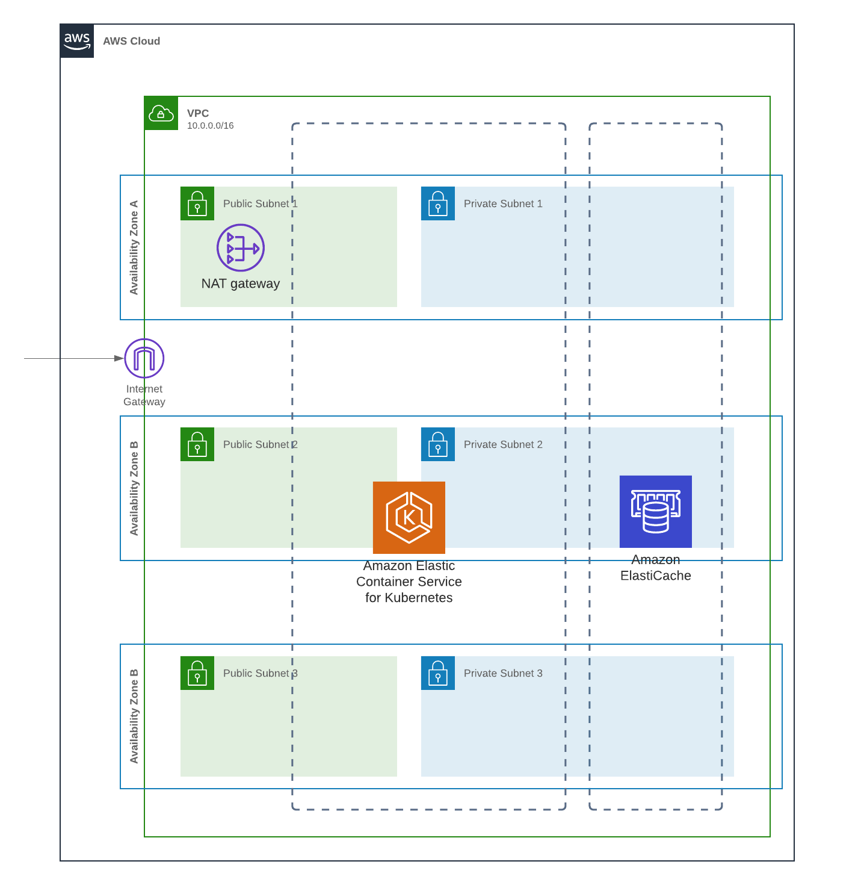

# Click Count application

[](https://travis-ci.org/xebia-france/click-count)

---

Sommaire
=================

<!--ts-->

- [Introduction, Description du travail effectué](#introduction-description-du-travail-effectué)
- [Pré-requis](#pré-requis)
- [Lancement du projet Java en local](#lancement-du-projet-java-en-local)
- [Solution basée sur une infra EC2](#solution-basée-sur-une-infra-ec2)
  * [Présentation infra EC2](#présentation-infra-ec2)
  * [Création de l'infra EC2, éxécution de la pipeline, suppression des ressources](#création-de-linfra-ec2-éxécution-de-la-pipeline-suppression-des-ressources)
- [Solution basée sur une infra Kubernetes](#fr-description-du-projet)
  * [Présentation infra Kube](#présentation-infra-kube)
  * [Création de l'infra Kube, éxécution de la pipeline, suppression des ressources](#création-de-linfra-ec2-éxécution-de-la-pipeline-suppression-des-ressources)


---

# Introduction, Description du travail effectué

Ce projet est composé de:
- Code source Java migré de `Tomcat` à `SpringBoot`
- Code d'infra et de pipeline pour des déploiements basés sur EC2
- Code d'infra et de pipeline pour des déploiements basés sur Kubernetes (AWS EKS)

Nous avons aussi introduit des tests d'intégration java en local basés sur `Docker` et `testcontainers` [https://www.testcontainers.org/](https://www.testcontainers.org/).

# Pré-requis

1. Forker le repo
2. Dans `infra/infra.env`, modifier:
  - 2.1 le nom du repo github avec votre identifiant
  - 2.2 le chemin vers une clé ssh publique que vous souhaitez utiliser pour accéder aux machines de rebond des différents environnements
3. Vous aurez aussi besoin de:
  - maven: [https://maven.apache.org/download.cgi](https://maven.apache.org/download.cgi)
  - aws cli: [https://docs.aws.amazon.com/cli/latest/userguide/install-cliv2.html](https://docs.aws.amazon.com/cli/latest/userguide/install-cliv2.html)
  - packer pour les déploiements basés sur EC2: [https://www.packer.io/downloads](https://www.packer.io/downloads)
  - make: [https://www.gnu.org/software/make/](https://www.gnu.org/software/make/)
  - eksctl: [https://eksctl.io/](https://eksctl.io/)
  - Docker pour lancer les tests d'intégration en local: [https://docs.docker.com/engine/install/](https://docs.docker.com/engine/install/)
  - Docker-Compose pour lancer les tests d'intégration en local: [https://docs.docker.com/compose/](https://docs.docker.com/compose/)

# Lancement du projet Java en local

- build de l'application
  - `mvn clean verify` pour builder le jar de l'application et lancer les tests d'intégration dockerisés
  - `mvn clean verify -P docker` pour builder l'image `Docker` de l'application et lancer les tests d'intégration dockerisés
- éxécution en local:
  - Lancer une instance locale de `Redis`: `docker-compose down && docker-compose up`
  - Lancer l'application: `mvn spring-boot:run` ou via l'IDE
  - éxécuter des requêtes sur l'API REST: 

```shell
08:34:03 joseph@joseph-ThinkPad-T480 infra ±|main ✗|→ curl localhost:8080/healthcheck -w"\n"
ok
08:34:06 joseph@joseph-ThinkPad-T480 infra ±|main ✗|→ curl localhost:8080/click -w"\n"
8
08:35:20 joseph@joseph-ThinkPad-T480 infra ±|main ✗|→ curl -X POST localhost:8080/click -w"\n"
9

```

# Solution basée sur une infra EC2

## Présentation infra EC2

Voici un schema de l'infrastructure d'un environnement (staging ou production) basé sur EC2:


Chaque environnement est dans son propre VPC et utilise un même template `CloudFormation` paramétrable en fonction des spécificités de l'environnement.

Notre application tourne dans une instance EC2, dans un sous-réseau privé, et est accessible depuis l'extérieur via un "internet-facing" load balancer

Le code de cette infra se trouve dans `infra/ec2-environment`, est composé de plusieurs "modules", assemblés dans `infra/ec2-environment/ec2-environment.yml`

Tout est créé via `CloudFormation`, à l'éxécution de l'AMI de nos instances de staging et production, qui utilise `Packer`.
La création du tout: ami, environnement (réseau, cluster redis, instance EC2), pipeline est orchestré par `Makefile`

## Création de l'infra EC2, éxécution de la pipeline, suppression des ressources

L'infra est créée par un `Makefile`.
0. forkez le repo et modifier la variable `GITHUB_REPO` dans `infra/infra.env` (cf [pré-requis](#pré-requis))
1. déplacez-vous dans le répertoire `infra`: `cd infra`
2. lancez la création des environnements `staging`, `production` et la pipeline de déploiement: `make ec2-all APPLICATION_NAME=click-count`. Vérifiez la création des stacks `CloudFormation`. Comptez 20-30 minutes


3. Activez la connexion github dans `Developer Tools`. cf documentation [https://docs.aws.amazon.com/dtconsole/latest/userguide/connections-update.html](https://docs.aws.amazon.com/dtconsole/latest/userguide/connections-update.html)


4. Relancez la pipeline si elle a échoué (à cause de la connection gitub non-activée). Elle devrait s'éxécuter sans problème jusqu'en staging


5. La pipeline éxécute des tests sur l'application déployée en staging, mais assurons-nous en par un test manuel. 
  - Récupérez l'addresse publique du load balancer:


  - éxécutons des requêtes curl sur les différents endpoints:

```shell
09:20:57 joseph@joseph-ThinkPad-T480 ~ → curl click-count-staging-lb-1907317151.eu-west-3.elb.amazonaws.com/healthcheck -w "\n"
ok
09:21:07 joseph@joseph-ThinkPad-T480 ~ → curl click-count-staging-lb-1907317151.eu-west-3.elb.amazonaws.com/click -w "\n"
1
09:21:14 joseph@joseph-ThinkPad-T480 ~ → curl -X POST click-count-staging-lb-1907317151.eu-west-3.elb.amazonaws.com/click -w "\n"
2
```

6. Approuvons le déploiement en production


Cliquons ensuite sur "Approve":


La pipeline devrait être verte en prod aussi:


Ici aussi, on peut se convaincre que tout a bien marché par un test manuel:

On récupère l'url du Load Balancer de prod:


On effectue nos requêtes `curl` de test:

```shell
09:31:32 joseph@joseph-ThinkPad-T480 ~ → curl click-count-production-lb-670199883.eu-west-3.elb.amazonaws.com/healthcheck -w "\n"
ok
09:32:19 joseph@joseph-ThinkPad-T480 ~ → curl click-count-production-lb-670199883.eu-west-3.elb.amazonaws.com/click -w "\n"
1
09:32:26 joseph@joseph-ThinkPad-T480 ~ → curl -X POST click-count-production-lb-670199883.eu-west-3.elb.amazonaws.com/click -w "\n"
2
```

7. Nous pouvons désormais supprimer toutes les ressources créées:
`make delete-ec2-all APPLICATION_NAME=click-count`

Le processus est un peu long, 15-20 minutes, mais toutes les ressources devraient être supprimées avec succès :


Et l'AMI créée devrait elle aussi être supprimée:


# Solution basée sur une infra Kubernetes

## Présentation infra Kube

Voici l'infrastructure `Kubernetes` qui sera créée:



Nous n'avons pas trouvé de moyen de créer facilement et dans le temps imparti le cluster Kubernetes via `CloudFormation` uniquement. 
Nous avons donc fini par nous résoudre à créer le cluster et le réseau via l'outil `eksctl`, qui est conseillé par la documentation d'AWS pour démarrer. 


## Création de l'infra Kube, éxécution de la pipeline, suppression des ressources

# Notes

1. Le build échoue initialement -> il faut ajouter une version plus récente du plugin maven `maven-war-plugin` ... au final, autant utiliser spring-boot

```log
[ERROR] Failed to execute goal org.apache.maven.plugins:maven-war-plugin:2.2:war (default-war) on project clickCount: Execution default-war of goal org.apache.maven.plugins:maven-war-plugin:2.2:war failed: Unable to load the mojo 'war' in the plugin 'org.apache.maven.plugins:maven-war-plugin:2.2' due to an API incompatibility: org.codehaus.plexus.component.repository.exception.ComponentLookupException: Cannot access defaults field of Properties
[ERROR] -----------------------------------------------------
[ERROR] realm =    plugin>org.apache.maven.plugins:maven-war-plugin:2.2
[ERROR] strategy = org.codehaus.plexus.classworlds.strategy.SelfFirstStrategy
```